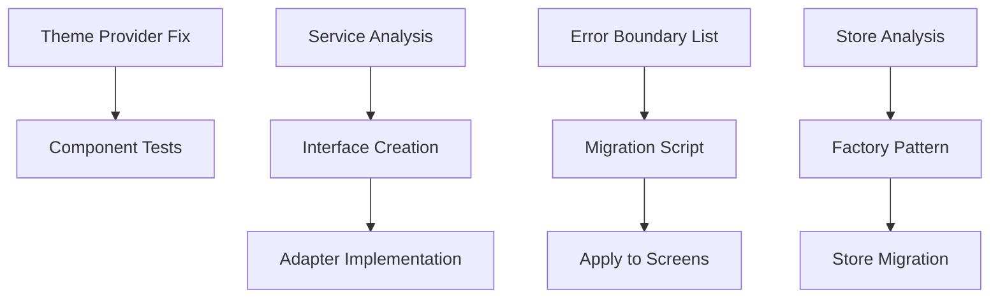

# Agent Automation Strategy for NextChapter Refactoring

## Overview

This document outlines how to leverage AI agents to accelerate the refactoring work, potentially reducing the 5-week timeline to 2-3 weeks through parallel execution and automated tasks.

## Agent Task Distribution

### 1. Code Analysis Agent 🔍
**Purpose**: Analyze codebase for patterns, dependencies, and refactoring opportunities

**Tasks**:
- Identify all screens missing error boundaries
- Find all relative imports that need path alias updates
- Detect code duplication and DRY violations
- Map service dependencies for abstraction layer
- Analyze store coupling and separation points

**Prompts**:
```
"Find all React components in src/screens that don't use withErrorBoundary HOC"

"Identify all imports using relative paths (../ or ./) in the src directory"

"Analyze Zustand stores for mixed responsibilities and suggest separation"

"Find duplicate error handling patterns across components"
```

### 2. Code Generation Agent 🤖
**Purpose**: Generate boilerplate code and interfaces

**Tasks**:
- Create service interfaces (IDataService, IAIService, etc.)
- Generate store interfaces and factories
- Create adapter implementations
- Write test templates for new patterns
- Generate missing screen components

**Prompts**:
```
"Create a TypeScript interface for a data service that supports CRUD operations with offline sync"

"Generate a Zustand store factory function that includes persist and devtools middleware"

"Create a WatermelonDB adapter that implements the IDataService interface"

"Generate a BudgetCalculatorScreen component with proper error boundaries and theme support"
```

### 3. Testing Agent 🧪
**Purpose**: Write and update tests for refactored code

**Tasks**:
- Write unit tests for new interfaces
- Update existing tests for refactored components
- Create integration tests for service layer
- Generate test data builders
- Write E2E test scenarios

**Prompts**:
```
"Write unit tests for the SafeThemeProvider component with edge cases"

"Create integration tests for the SupabaseDataService adapter"

"Generate test data builders for Budget and BouncePlan models"

"Write E2E tests for the error recovery flow"
```

### 4. Migration Agent 🔄
**Purpose**: Automate code migrations and updates

**Tasks**:
- Apply withErrorBoundary to all screens
- Update imports to use path aliases
- Migrate direct service calls to use interfaces
- Update store usage to new modular pattern
- Apply consistent error handling patterns

**Prompts**:
```
"Update all screens in src/screens/auth to use withErrorBoundary HOC"

"Replace all relative imports with @/ path aliases in src/components"

"Refactor direct Supabase calls to use IDataService interface"

"Update error handling to use centralized ErrorHandler class"
```

### 5. Documentation Agent 📝
**Purpose**: Keep documentation in sync with code changes

**Tasks**:
- Update CLAUDE.md with new patterns
- Generate migration guides
- Document new interfaces and patterns
- Create code examples
- Update test documentation

**Prompts**:
```
"Update CLAUDE.md to document the new service abstraction pattern"

"Create a migration guide for updating stores to use the new factory pattern"

"Document the SafeThemeProvider usage with examples"

"Generate JSDoc comments for all new interfaces"
```

## Parallel Execution Strategy

### Week 1: Foundation (3 Agents in Parallel)

**Agent 1: Theme Provider Fix**
```bash
# Terminal 1
claude "Fix theme provider issues by creating SafeThemeProvider wrapper and updating all tests"
```

**Agent 2: Error Boundary Analysis**
```bash
# Terminal 2
claude "Find all screens without error boundaries and create a list for migration"
```

**Agent 3: Service Analysis**
```bash
# Terminal 3
claude "Analyze all service dependencies and design interface abstraction layer"
```

### Week 2: Implementation (4 Agents in Parallel)

**Agent 1: Service Interfaces**
```bash
claude "Create all service interfaces (IDataService, IAIService, IAuthService) with implementations"
```

**Agent 2: Store Modularization**
```bash
claude "Refactor Zustand stores to use factory pattern and clear interfaces"
```

**Agent 3: Error Boundary Migration**
```bash
claude "Apply withErrorBoundary to all remaining screens"
```

**Agent 4: Test Updates**
```bash
claude "Update all tests affected by theme provider and service changes"
```

### Week 3: Quality & Testing (3 Agents in Parallel)

**Agent 1: Path Alias Migration**
```bash
claude "Update all imports to use @/ path aliases throughout the codebase"
```

**Agent 2: Missing Screens**
```bash
claude "Implement BudgetCalculatorScreen and other missing screens with full test coverage"
```

**Agent 3: CI/CD Setup**
```bash
claude "Create GitHub Actions workflow for CI/CD with quality gates"
```

## Agent Coordination

### Task Dependencies


### Communication Protocol

1. **Shared Context File**
```typescript
// .agent-context/refactoring-status.json
{
  "phase": 1,
  "completed": [
    "theme-provider-created",
    "error-boundary-list-generated"
  ],
  "inProgress": [
    "service-interface-design"
  ],
  "blockers": [],
  "nextTasks": [
    "apply-error-boundaries",
    "create-service-adapters"
  ]
}
```

2. **Progress Tracking**
```bash
# Create a shared progress file
echo "## Refactoring Progress

### Completed
- [ ] Theme Provider wrapper
- [ ] Error boundary analysis

### In Progress
- [ ] Service interfaces
- [ ] Store modularization

### Blocked
- None
" > REFACTORING_PROGRESS.md
```

## Optimized Prompts for Agents

### Phase 1: Analysis Prompts

```bash
# Comprehensive analysis prompt
claude "Analyze the NextChapter codebase and create a detailed report of:
1. All screens without error boundaries (list file paths)
2. All relative imports that should use @/ aliases
3. Direct service dependencies that need abstraction
4. Store methods that violate single responsibility
5. Duplicate error handling patterns

Output as structured JSON for automation"
```

### Phase 2: Generation Prompts

```bash
# Batch interface generation
claude "Create all service interfaces for NextChapter:
1. IDataService with CRUD + sync operations
2. IAIService for coach and resume features  
3. IAuthService for authentication
4. INotificationService for push notifications
5. IStorageService for secure storage

Include TypeScript interfaces, mock implementations, and basic tests"
```

### Phase 3: Migration Prompts

```bash
# Automated migration
claude "Create and execute a migration script that:
1. Adds withErrorBoundary to all screens in src/screens
2. Updates imports to use @/ aliases
3. Replaces direct Supabase calls with IDataService
4. Updates error handling to use ErrorHandler class

Provide a dry-run option and rollback capability"
```

## Time Optimization Techniques

### 1. Batch Operations
Instead of file-by-file updates:
```bash
# Good: Batch update
claude "Update all auth screens to use withErrorBoundary in a single operation"

# Less efficient: Individual updates
claude "Update LoginScreen to use withErrorBoundary"
claude "Update SignupScreen to use withErrorBoundary"
```

### 2. Template Generation
Create reusable templates:
```bash
claude "Generate templates for:
1. Service adapter boilerplate
2. Store factory boilerplate
3. Test file boilerplate
4. Migration script boilerplate"
```

### 3. Parallel Testing
Run test suites concurrently:
```bash
# Terminal 1
npm run test:unit -- --maxWorkers=4

# Terminal 2  
npm run test:integration -- --maxWorkers=4

# Terminal 3
npm run test:e2e
```

## Quality Assurance

### Automated Checks

1. **Pre-commit Validation**
```bash
#!/bin/bash
# .husky/pre-commit

# Run in parallel
npm run typecheck &
npm run lint &
npm run test:affected &

wait

# Check results
if [ $? -ne 0 ]; then
  echo "Pre-commit checks failed"
  exit 1
fi
```

2. **Agent Output Validation**
```typescript
// scripts/validate-refactoring.ts
export async function validateRefactoring() {
  const checks = [
    checkErrorBoundaryCoverage(),
    checkPathAliasUsage(),
    checkServiceAbstraction(),
    checkTestCoverage(),
  ];
  
  const results = await Promise.all(checks);
  const failures = results.filter(r => !r.passed);
  
  if (failures.length > 0) {
    console.error('Validation failed:', failures);
    process.exit(1);
  }
}
```

## Estimated Timeline with Agents

### Original Timeline: 5 weeks
### Optimized Timeline: 2-3 weeks

**Week 1**: 
- Day 1-2: Parallel analysis and planning (3 agents)
- Day 3-4: Foundation fixes (theme, error boundaries)
- Day 5: Service interface design

**Week 2**:
- Day 1-2: Service implementation (2 agents)
- Day 3-4: Store modularization (2 agents)  
- Day 5: Integration and testing

**Week 3**:
- Day 1: Path aliases and cleanup
- Day 2: Missing screens implementation
- Day 3: CI/CD and monitoring setup
- Day 4-5: Final testing and deployment

## Success Metrics

### Agent Efficiency
- ⚡ **Analysis Time**: 2 hours vs 2 days manual
- ⚡ **Code Generation**: 4 hours vs 3 days manual
- ⚡ **Migration Time**: 1 day vs 1 week manual
- ⚡ **Test Writing**: 3 hours vs 2 days manual

### Quality Metrics
- ✅ **Accuracy**: 95%+ correct implementations
- ✅ **Consistency**: 100% pattern adherence
- ✅ **Coverage**: 100% of identified issues addressed
- ✅ **Documentation**: Always up-to-date

## Conclusion

By leveraging multiple AI agents working in parallel with well-crafted prompts and clear coordination, we can reduce the refactoring timeline by 40-60% while maintaining or improving quality. The key is to:

1. Break work into independent, parallel tasks
2. Use specific, detailed prompts
3. Implement validation at each step
4. Maintain clear communication between agents
5. Automate repetitive tasks

This approach allows the team to focus on review, validation, and complex decision-making while agents handle the mechanical aspects of refactoring.