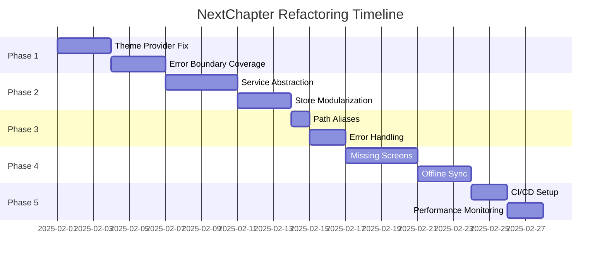

# NextChapter Refactoring Plan 2025

## Executive Summary

This document outlines a comprehensive 5-week refactoring strategy for the NextChapter React Native application. The plan focuses on applying SOLID principles, implementing DRY patterns, and improving overall code maintainability while preserving the app's mission of helping users through career transitions.

### Goals
- 🎯 100% error boundary coverage
- 🏗️ Implement proper service abstraction layer
- 📦 Modularize state management
- 🧪 Improve test infrastructure
- 🚀 Setup CI/CD pipeline
- 📊 Add performance monitoring

### Timeline
- **Week 1**: Foundation Fixes (Theme Provider, Error Boundaries)
- **Week 2**: Architecture Improvements (Service Abstraction, Store Modularization)
- **Week 3**: Code Quality (Path Aliases, Error Handling)
- **Week 4**: Testing Infrastructure (Missing Screens, Offline Sync)
- **Week 5**: DevOps & Monitoring (CI/CD, Performance)

---

## Phase 1: Foundation Fixes (Week 1)

### 1.1 Fix Theme Provider Issues ⚡

**Problem**: Theme-related rendering issues causing test failures and inconsistent UI.

**Solution**: Create a centralized `SafeThemeProvider` wrapper with test-friendly defaults.

#### Implementation Steps

1. **Create SafeThemeProvider Component**
```typescript
// src/components/common/SafeThemeProvider.tsx
import React from 'react';
import { ThemeProvider } from '@/context/ThemeContext';
import { theme } from '@/theme';

interface SafeThemeProviderProps {
  children: React.ReactNode;
  testTheme?: Partial<Theme>;
}

export const SafeThemeProvider: React.FC<SafeThemeProviderProps> = ({ 
  children, 
  testTheme 
}) => {
  const mergedTheme = { ...theme, ...testTheme };
  
  return (
    <ThemeProvider value={mergedTheme}>
      {children}
    </ThemeProvider>
  );
};
```

2. **Update Test Wrapper**
```typescript
// src/test-utils/testWrapper.tsx
export const renderWithProviders = (
  ui: React.ReactElement,
  options?: RenderOptions
) => {
  const AllTheProviders = ({ children }) => (
    <SafeThemeProvider testTheme={options?.theme}>
      <NavigationContainer>
        {children}
      </NavigationContainer>
    </SafeThemeProvider>
  );
  
  return render(ui, { wrapper: AllTheProviders, ...options });
};
```

3. **Migration Checklist**
- [ ] Create SafeThemeProvider component
- [ ] Update testWrapper.tsx
- [ ] Update App.tsx to use SafeThemeProvider
- [ ] Fix any theme-related test failures
- [ ] Document theme testing patterns

### 1.2 Complete Error Boundary Coverage 🛡️

**Problem**: 17 screens lack error boundaries, risking app crashes.

**Solution**: Apply `withErrorBoundary` HOC to all remaining screens.

#### Screens Requiring Error Boundaries

1. **Auth Screens**
   - BiometricAuthScreen
   - EmailVerificationScreen
   - ForgotPasswordScreen
   - TestAuthScreen

2. **Bounce Plan Screens**
   - TaskDetailScreen
   - DailyTaskScreen

3. **Budget Screens**
   - BudgetCalculatorScreen

4. **Profile Screens**
   - AboutScreen

5. **Tracker Screens**
   - JobApplicationsScreen

6. **Wellness Screens**
   - (Check for any missing)

#### Implementation Pattern
```typescript
// Before
export default ScreenName;

// After
import { withErrorBoundary } from '@/components/common/withErrorBoundary';

export default withErrorBoundary(ScreenName, 'ScreenName');
```

#### Automation Script
```bash
# Run the existing script
npm run add-error-boundaries
```

---

## Phase 2: Architecture Improvements (Week 2)

### 2.1 Create Service Abstraction Layer 🔌

**Problem**: Components directly depend on concrete implementations (Supabase, OpenAI).

**Solution**: Introduce interface-based abstractions following Dependency Inversion Principle.

#### Core Interfaces

1. **Base Data Service Interface**
```typescript
// src/services/interfaces/IDataService.ts
export interface IDataService {
  create<T>(collection: string, data: Omit<T, 'id'>): Promise<T>;
  read<T>(collection: string, id: string): Promise<T | null>;
  update<T>(collection: string, id: string, data: Partial<T>): Promise<T>;
  delete(collection: string, id: string): Promise<void>;
  list<T>(collection: string, filters?: QueryFilters): Promise<T[]>;
  sync<T>(collection: string, lastSync?: Date): Promise<SyncResult<T>>;
}

export interface QueryFilters {
  where?: Record<string, any>;
  orderBy?: { field: string; direction: 'asc' | 'desc' };
  limit?: number;
  offset?: number;
}

export interface SyncResult<T> {
  data: T[];
  conflicts: ConflictItem<T>[];
  lastSync: Date;
}
```

2. **AI Service Interface**
```typescript
// src/services/interfaces/IAIService.ts
export interface IAIService {
  sendMessage(message: string, context?: AIContext): Promise<AIResponse>;
  analyzeResume(content: string, jobDescription?: string): Promise<ResumeAnalysis>;
  detectEmotion(text: string): Promise<EmotionResult>;
}

export interface AIContext {
  tone: 'hype' | 'pragmatist' | 'tough-love';
  conversationHistory?: Message[];
  userProfile?: Partial<UserProfile>;
}
```

3. **Auth Service Interface**
```typescript
// src/services/interfaces/IAuthService.ts
export interface IAuthService {
  signUp(email: string, password: string): Promise<AuthResult>;
  signIn(email: string, password: string): Promise<AuthResult>;
  signOut(): Promise<void>;
  resetPassword(email: string): Promise<void>;
  verifyEmail(token: string): Promise<void>;
  enableBiometric(): Promise<void>;
  authenticateWithBiometric(): Promise<AuthResult>;
}
```

#### Implementation Adapters

1. **Supabase Adapter**
```typescript
// src/services/adapters/SupabaseDataService.ts
export class SupabaseDataService implements IDataService {
  constructor(private supabase: SupabaseClient) {}
  
  async create<T>(collection: string, data: Omit<T, 'id'>): Promise<T> {
    const { data: result, error } = await this.supabase
      .from(collection)
      .insert(data)
      .select()
      .single();
      
    if (error) throw new DataServiceError(error.message);
    return result;
  }
  // ... other methods
}
```

2. **WatermelonDB Adapter**
```typescript
// src/services/adapters/WatermelonDataService.ts
export class WatermelonDataService implements IDataService {
  constructor(private database: Database) {}
  
  async create<T>(collection: string, data: Omit<T, 'id'>): Promise<T> {
    const collection = this.database.get(collection);
    const record = await collection.create((record) => {
      Object.assign(record, data);
    });
    return record as T;
  }
  // ... other methods
}
```

### 2.2 Modularize State Management 📦

**Problem**: Zustand stores have mixed responsibilities and tight coupling.

**Solution**: Define clear store interfaces and apply Single Responsibility Principle.

#### Store Interfaces

```typescript
// src/stores/interfaces/IStore.ts
export interface IStore<T> {
  getState(): T;
  setState(partial: Partial<T> | ((state: T) => Partial<T>)): void;
  subscribe(listener: (state: T) => void): () => void;
  reset(): void;
}

// src/stores/interfaces/IAuthStore.ts
export interface IAuthStore extends IStore<AuthState> {
  signIn(email: string, password: string): Promise<void>;
  signOut(): Promise<void>;
  checkBiometric(): Promise<boolean>;
  user: User | null;
  isAuthenticated: boolean;
  loading: boolean;
  error: string | null;
}
```

#### Store Factory Pattern

```typescript
// src/stores/factories/createStore.ts
export function createStore<T>(
  name: string,
  initialState: T,
  actions?: (set: SetState<T>, get: GetState<T>) => Partial<T>
): UseBoundStore<StoreApi<T>> {
  return create<T>()(
    devtools(
      persist(
        (set, get) => ({
          ...initialState,
          ...actions?.(set, get),
          reset: () => set(initialState),
        }),
        {
          name: `${name}-storage`,
          storage: createJSONStorage(() => AsyncStorage),
        }
      )
    )
  );
}
```

---

## Phase 3: Code Quality (Week 3)

### 3.1 Apply Path Aliases Consistently 🛤️

**Problem**: Mixed use of relative and absolute imports causing maintenance issues.

**Solution**: Enforce path aliases across the entire codebase.

#### Update Script
```bash
#!/bin/bash
# scripts/update-path-aliases.sh

# Find all TypeScript files
find src -name "*.ts" -o -name "*.tsx" | while read file; do
  # Replace relative imports with aliases
  sed -i '' "s|from '\.\./\.\./|from '@/|g" "$file"
  sed -i '' "s|from '\.\./|from '@/|g" "$file"
  sed -i '' "s|from '\./|from '@/|g" "$file"
done

# Run ESLint to fix any issues
npm run lint:fix
```

#### ESLint Rule
```javascript
// .eslintrc.js
module.exports = {
  rules: {
    'no-restricted-imports': [
      'error',
      {
        patterns: ['../*', './*'],
        message: 'Use path aliases (e.g., @/components) instead of relative imports',
      },
    ],
  },
};
```

### 3.2 Consolidate Error Handling 🚨

**Problem**: Scattered error handling logic across components.

**Solution**: Centralize error processing in GlobalErrorHandler.

#### Enhanced Error Handler
```typescript
// src/utils/errorHandling.ts
export class AppError extends Error {
  constructor(
    message: string,
    public code: string,
    public severity: 'low' | 'medium' | 'high' | 'critical',
    public userMessage?: string,
    public context?: Record<string, any>
  ) {
    super(message);
    this.name = 'AppError';
  }
}

export class ErrorHandler {
  private static instance: ErrorHandler;
  private errorQueue: AppError[] = [];
  
  static getInstance(): ErrorHandler {
    if (!ErrorHandler.instance) {
      ErrorHandler.instance = new ErrorHandler();
    }
    return ErrorHandler.instance;
  }
  
  handle(error: Error | AppError, context?: Record<string, any>): void {
    const appError = this.normalizeError(error, context);
    
    // Log to console in development
    if (__DEV__) {
      console.error(appError);
    }
    
    // Queue for analytics
    this.errorQueue.push(appError);
    
    // Show user-friendly message
    this.showUserMessage(appError);
    
    // Report critical errors immediately
    if (appError.severity === 'critical') {
      this.reportError(appError);
    }
  }
  
  private normalizeError(error: Error, context?: Record<string, any>): AppError {
    if (error instanceof AppError) {
      return error;
    }
    
    // Map common errors to user-friendly messages
    const errorMappings = {
      'Network request failed': {
        userMessage: 'Connection issue. Please check your internet.',
        severity: 'medium' as const,
        code: 'NETWORK_ERROR',
      },
      'Invalid credentials': {
        userMessage: 'Email or password incorrect. Please try again.',
        severity: 'low' as const,
        code: 'AUTH_ERROR',
      },
    };
    
    const mapping = Object.entries(errorMappings).find(([key]) => 
      error.message.includes(key)
    );
    
    if (mapping) {
      const [, config] = mapping;
      return new AppError(
        error.message,
        config.code,
        config.severity,
        config.userMessage,
        context
      );
    }
    
    return new AppError(
      error.message,
      'UNKNOWN_ERROR',
      'medium',
      'Something went wrong. Please try again.',
      context
    );
  }
}
```

---

## Phase 4: Testing Infrastructure (Week 4)

### 4.1 Build Missing Screens 🏗️

**Priority Screens for Integration Tests**

1. **BudgetCalculatorScreen**
```typescript
// src/screens/budget/BudgetCalculatorScreen.tsx
import React from 'react';
import { withErrorBoundary } from '@/components/common/withErrorBoundary';
import { BudgetForm, RunwayIndicator } from '@/components/feature/budget';
import { useBudgetStore } from '@/stores/budgetStore';

const BudgetCalculatorScreen: React.FC = () => {
  const { calculateRunway, updateBudget } = useBudgetStore();
  
  return (
    <Container>
      <Header title="Budget Calculator" />
      <ScrollView>
        <BudgetForm onSubmit={updateBudget} />
        <RunwayIndicator />
      </ScrollView>
    </Container>
  );
};

export default withErrorBoundary(BudgetCalculatorScreen, 'BudgetCalculatorScreen');
```

2. **TaskDetailScreen Updates**
- Add edit functionality
- Implement notes feature
- Add completion animations

### 4.2 Refine Offline Sync Logic 🔄

**Sync Conflict Resolution Utilities**

```typescript
// src/services/sync/ConflictResolver.ts
export interface ConflictStrategy<T> {
  resolve(local: T, remote: T): T;
}

export class LastWriteWinsStrategy<T extends { updatedAt: Date }> 
  implements ConflictStrategy<T> {
  resolve(local: T, remote: T): T {
    return local.updatedAt > remote.updatedAt ? local : remote;
  }
}

export class ClientWinsStrategy<T> implements ConflictStrategy<T> {
  resolve(local: T, remote: T): T {
    return local;
  }
}

export class MergeStrategy<T> implements ConflictStrategy<T> {
  constructor(private mergeFunction: (local: T, remote: T) => T) {}
  
  resolve(local: T, remote: T): T {
    return this.mergeFunction(local, remote);
  }
}

export class ConflictResolver {
  private strategies = new Map<string, ConflictStrategy<any>>();
  
  register<T>(type: string, strategy: ConflictStrategy<T>): void {
    this.strategies.set(type, strategy);
  }
  
  resolve<T>(type: string, local: T, remote: T): T {
    const strategy = this.strategies.get(type);
    if (!strategy) {
      throw new Error(`No conflict strategy registered for type: ${type}`);
    }
    return strategy.resolve(local, remote);
  }
}
```

---

## Phase 5: DevOps & Monitoring (Week 5)

### 5.1 Setup CI/CD Pipeline 🚀

**GitHub Actions Configuration**

```yaml
# .github/workflows/ci.yml
name: CI/CD Pipeline

on:
  push:
    branches: [main, develop]
  pull_request:
    branches: [main]

jobs:
  quality-checks:
    runs-on: ubuntu-latest
    steps:
      - uses: actions/checkout@v3
      
      - name: Setup Node.js
        uses: actions/setup-node@v3
        with:
          node-version: '18'
          cache: 'npm'
      
      - name: Install dependencies
        run: npm ci
      
      - name: Run TypeScript check
        run: npm run typecheck
      
      - name: Run ESLint
        run: npm run lint
      
      - name: Run tests with coverage
        run: npm run test:coverage
      
      - name: Check coverage thresholds
        run: |
          coverage=$(cat coverage/coverage-summary.json | jq '.total.lines.pct')
          if (( $(echo "$coverage < 80" | bc -l) )); then
            echo "Coverage is below 80%"
            exit 1
          fi
      
      - name: Upload coverage reports
        uses: codecov/codecov-action@v3
        with:
          file: ./coverage/lcov.info
      
      - name: Run E2E tests
        run: npm run test:e2e:ci
      
      - name: Bundle size check
        run: npm run analyze:bundle
      
      - name: Build check
        run: npm run build

  deploy-preview:
    needs: quality-checks
    if: github.event_name == 'pull_request'
    runs-on: ubuntu-latest
    steps:
      - name: Deploy to Expo Preview
        run: eas build --platform all --profile preview
```

### 5.2 Performance Monitoring Setup 📊

**Sentry Integration**

```typescript
// src/services/monitoring/sentry.ts
import * as Sentry from '@sentry/react-native';

export const initializeSentry = () => {
  Sentry.init({
    dsn: process.env.SENTRY_DSN,
    environment: __DEV__ ? 'development' : 'production',
    tracesSampleRate: __DEV__ ? 1.0 : 0.1,
    integrations: [
      new Sentry.ReactNativeTracing({
        routingInstrumentation,
        tracingOrigins: ['localhost', /^\//],
      }),
    ],
    beforeSend: (event, hint) => {
      // Sanitize sensitive data
      if (event.user) {
        delete event.user.email;
      }
      return event;
    },
  });
};

// Performance monitoring utilities
export const trackPerformance = {
  measureScreenLoad: (screenName: string) => {
    const transaction = Sentry.startTransaction({
      name: `Screen Load: ${screenName}`,
      op: 'navigation',
    });
    
    return () => {
      transaction.finish();
    };
  },
  
  measureAPICall: (endpoint: string) => {
    const span = Sentry.getCurrentHub()
      .getScope()
      ?.getTransaction()
      ?.startChild({
        op: 'http',
        description: endpoint,
      });
    
    return () => {
      span?.finish();
    };
  },
};
```

---

## Implementation Guidelines

### Branch Strategy
```bash
# Feature branches
git checkout -b refactor/error-boundaries
git checkout -b refactor/theme-provider
git checkout -b refactor/service-abstraction
git checkout -b refactor/store-modules

# Naming convention
refactor/[feature-name]
fix/[issue-description]
chore/[task-description]
```

### Pull Request Template
```markdown
## Description
Brief description of changes

## Type of Change
- [ ] Bug fix
- [ ] New feature
- [ ] Refactoring
- [ ] Documentation update

## Testing
- [ ] Unit tests pass
- [ ] Integration tests pass
- [ ] Manual testing completed

## Checklist
- [ ] Code follows SOLID principles
- [ ] No code duplication (DRY)
- [ ] Error handling implemented
- [ ] Tests added/updated
- [ ] Documentation updated
```

### Code Review Checklist
1. **SOLID Compliance**
   - [ ] Single Responsibility: Each module has one reason to change
   - [ ] Open/Closed: New features extend, don't modify
   - [ ] Liskov Substitution: Subtypes are substitutable
   - [ ] Interface Segregation: No unused dependencies
   - [ ] Dependency Inversion: Depend on abstractions

2. **DRY Principle**
   - [ ] No duplicated logic
   - [ ] Shared utilities extracted
   - [ ] Consistent patterns used

3. **Testing**
   - [ ] Unit tests for new code
   - [ ] Integration tests updated
   - [ ] Edge cases covered

4. **Performance**
   - [ ] No memory leaks
   - [ ] Efficient re-renders
   - [ ] Bundle size impact checked

---

## Risk Mitigation

### Feature Flags
```typescript
// src/config/featureFlags.ts
export const FEATURE_FLAGS = {
  USE_NEW_ERROR_HANDLER: process.env.USE_NEW_ERROR_HANDLER === 'true',
  USE_SERVICE_ABSTRACTION: process.env.USE_SERVICE_ABSTRACTION === 'true',
  ENABLE_PERFORMANCE_MONITORING: process.env.ENABLE_PERF_MONITORING === 'true',
};
```

### Rollback Plan
1. **Version Tags**: Tag each phase completion
2. **Database Migrations**: Keep backward compatibility
3. **API Versioning**: Support old clients during transition
4. **Monitoring**: Alert on error rate increases

### Gradual Rollout
```typescript
// src/utils/rollout.ts
export const isFeatureEnabled = (
  feature: string, 
  userId: string
): boolean => {
  const rolloutPercentage = ROLLOUT_CONFIG[feature] || 0;
  const hash = hashCode(userId + feature);
  return (hash % 100) < rolloutPercentage;
};
```

---

## Success Metrics

### Technical Metrics
- ✅ **Error Boundary Coverage**: 100% (from 32%)
- ✅ **Test Coverage**: >85% (maintain current)
- ✅ **TypeScript Strict**: No errors
- ✅ **Bundle Size**: <5MB increase
- ✅ **Cold Start**: <3s maintained

### Quality Metrics
- ✅ **Code Duplication**: <3% (measured by jscpd)
- ✅ **Cyclomatic Complexity**: <10 per function
- ✅ **Dependency Coupling**: Reduced by 30%
- ✅ **Build Time**: <5 minutes

### User Impact Metrics
- ✅ **Crash Rate**: <0.5%
- ✅ **JS Error Rate**: <1%
- ✅ **User Retention**: No decrease
- ✅ **App Store Rating**: Maintained

---

## Timeline Summary



---

## Next Steps

1. **Review & Approve**: Team review of this plan
2. **Resource Allocation**: Assign developers to phases
3. **Kickoff Meeting**: Align on implementation details
4. **Create Tracking Board**: Setup project board with all tasks
5. **Begin Phase 1**: Start with Theme Provider fixes

This comprehensive plan provides a clear roadmap for improving the NextChapter codebase while maintaining stability and user experience.